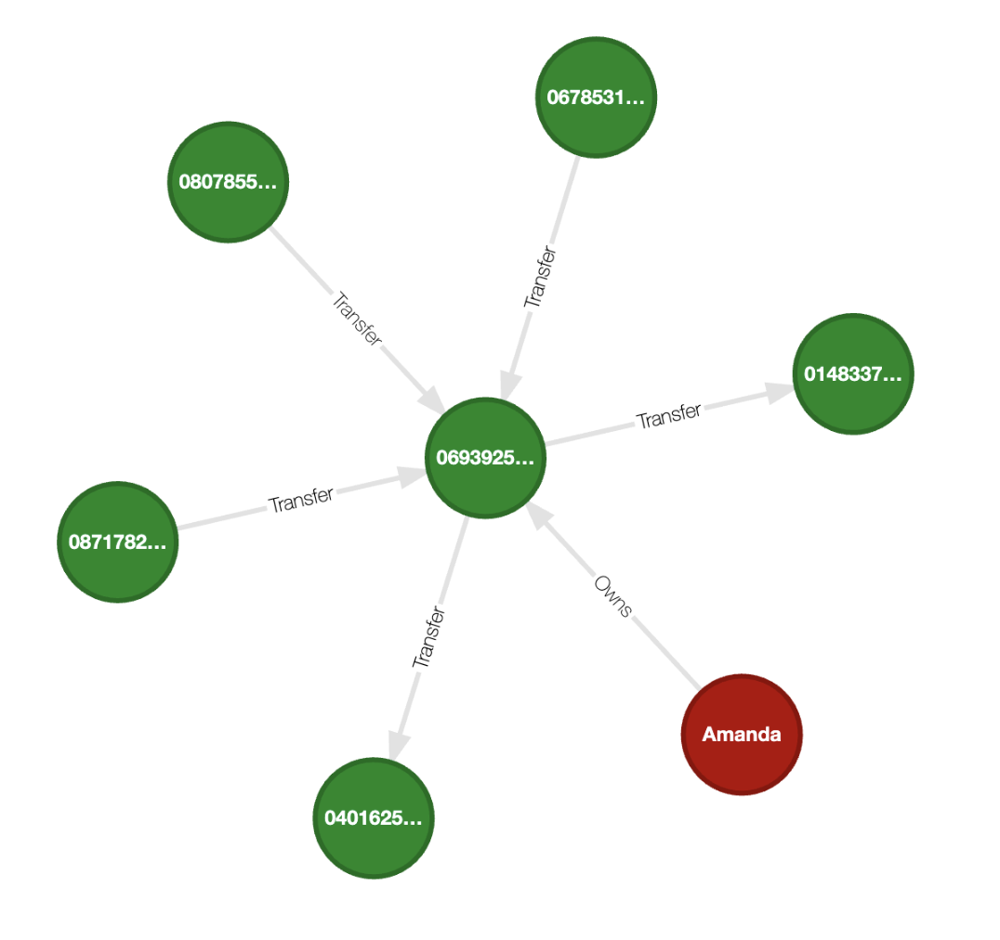

# Copy from Postgres database to Kùzu

This demo shows how to attach an external Postgres database to Kùzu and copy data from it to a Kùzu database to run graph
analytics. This is especially useful when the query workloads benefit from graphs, and the data sits in
a primary store like Postgres.

## Problem statement

The dataset consists of a financial network of persons, the addresses they live in, and transfers of
money between their accounts. Each transfer has a source account, a destination account, and an amount.
The goal is to find the accounts that are most "influential" in the network, and the persons who own
these accounts. This is a typical graph analytics problem.

We will be computing the "betweenness centrality" of account nodes in the network, which is a measure
of the number of shortest paths that pass through a node. It is calculated as the number of shortest
paths that pass through a node divided by the total number of shortest paths between all pairs of nodes.

## Setup

Install the required dependencies via the `uv` package manager and `requirements.txt` file as follows:
```
# Crate a virtual environment
uv venv
# On macOS and Linux
source .venv/bin/activate
# On Windows
.venv\Scripts\activate
# Install the required dependencies
uv pip install -r requirements.txt
```

## Run the Postgres database

Postgres is run via Docker. To start the Postgres database, run the following command:
```bash
docker run --name kuzu-postgres -e POSTGRES_PASSWORD=testpassword -p 5432:5432 --rm postgres:latest
```
This runs a **non-persistent** Postgres database. The database is deleted when the container is stopped.
This is fine for this demo and for testing purposes.

## Run the workflow

The code is run in the 3 provided scripts.

- `insert_data_pg.py` inserts the raw data from the provided CSV files in `./data` into the Postgres database
- `copy_pg_to_kuzu.py` copies the data from the Postgres database to Kùzu via the external database extension
(Postgres tables are directly scanned and copied over to Kùzu)
- `analyze.py` computes the betweenness centrality of the account nodes in the network and writes the computed
values back to the Postgres `account` table

To run the workflow, execute the following commands:
```bash
python insert_data_pg.py
python copy_pg_to_kuzu.py
python analyze.py
```

Alternatively, you can run the workflow in a single command:
```bash
bash run_all.sh
```

This will insert the data into the Postgres database, copy the data to Kùzu, run the graph analytics
to compute the betweenness centrality of the account nodes, and write the results back to the Postgres database.

## Data visualization

The schema of the graph constructed from the Postgres data is as follows:


It consists of the following data:
- 21 nodes of type Person
- 21 nodes of type Account (each Person has exactly one account)
- 15 nodes of type Address
- 21 relationships of type Transfer, where the transfers are directed from a source account s that has transferred money to a destination account d.

The resulting graph from this dataset has interesting structures, and is small enough to visualize all at once in Kùzu explorer. An example visualization is shown below:


## Analysis results

The results are stored in the `account` table in the Postgres database. The `betweenness_centrality` column
contains the computed betweenness centrality values for each account node.

When sorted in descending order, the following nodes are on top in terms of their betweenness centrality:

| account_id | betweenness_centrality |
| --- | --- |
18 | 069392555 | 0.4509804
8 | 082388575 | 0.23529412
13 | 040162526 | 0.20261438
11 | 067853119 | 0.1764706
3 | 080785523 | 0.15359478

When viewed in a graph visualization tool like Kùzu Explorer,
the node with the highest betweenness centrality (account_id = 069392555), can be seen below.
The account is owned by the person named "Amanda", whose account sees 3 incoming transfers and 2
outgoing transfers, and is connected to 5 other accounts, making it a key node in the network.

