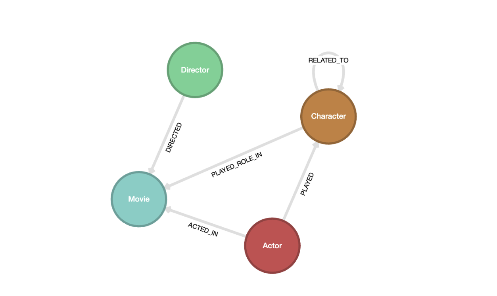
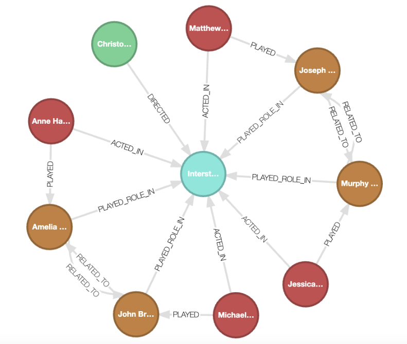

# Graph RAG

We show a simple example of how to use Kùzu as a graph store to build a Graph RAG system.

The aim of Graph RAG is to utilize a graph that explicitly stores relationships in the data to
help provide LLMs with factual knowledge to answer questions about the data.

## Setup

We will be using the Python API of Kùzu and a combination of scripts that utilize the required
dependencies. It's strongly recommended to use Astral's uv package manager to manage both Python
and its dependencies. You can install the required version of Python (3.12) using uv with the
following command:

```bash
uv python install 3.12
```

All the dependencies are indicated in the `pyproject.toml` file and the associated `uv.lock` file
provided in this repo. Simply sync the dependencies to your local virtual environment with the
following command:

```bash
uv sync
```

This will set up the virtual environment and install all the dependencies locally on your machine.

## Visualization

Visualization of the graph requires the [Kuzu Explorer](https://github.com/kuzudb/explorer) tool.
You can start an instance of the Explorer using a Docker command.
```bash
docker run -p 8000:8000 \
           -v ./ex_kuzu_db:/database \
           -e MODE=READ_ONLY \
           --rm kuzudb/explorer:latest
```
Alternatively, you can use the provided docker-compose.yml configured with the relative path to your data and start/stop the container as follows:

### Run container

```bash
docker compose up
```

### Stop container

```bash
docker compose down
```

## Running the scripts

### Create the graph

The data for the graph is stored in the `./data/interstellar` folder. The `create_graph.py` script
will create the graph from the data.

```bash
uv run create_graph.py
```

This creates a movie graph with the following schema:



From the shell editor in Kùzu Explorer, you can run the following Cypher query to display all the
nodes and edges in the graph:

```cypher
MATCH (a)-[r]->(b)
RETURN *a, r, b*
LIMIT 100
```




### Graph RAG

We will use the `ell` language model prompting framework to translate human questions from natural
language to a structured query language (Cypher) that can be executed against the graph in Kùzu.

```bash
uv run graph_rag.py
```

The following text is output into the console:

```
MATCH (a:Actor)-[:PLAYED]->(c:Character {name: 'Murphy Cooper'})<-[:PLAYED_ROLE_IN]-(m:Movie {title: 'Interstellar'})
RETURN a.name, a.age

Q1: In the movie Interstellar, who played Murphy Cooper? How old is the actor who played her?

In the movie Interstellar, Murphy Cooper was played by Jessica Chastain. She is 47 years old.
---


MATCH (father:Character)-[:RELATED_TO]->(murphy:Character {name: 'Murphy Cooper'}), 
      (father)-[:PLAYED_ROLE_IN]->(movie:Movie {title: 'Interstellar'})
RETURN father.name, movie.title

Q2: Who was Murphy Cooper's father in the movie Interstellar? What did he do?

Murphy Cooper's father in the movie Interstellar is Joseph Cooper. He is a former NASA pilot and engineer who becomes a key figure in the mission to save humanity by exploring other planets.
---


MATCH (c:Character {name: 'Tom Cooper'})-[:RELATED_TO]->(brother:Character {name: 'Murphy'}), 
      (c)-[:PLAYED_ROLE_IN]->(m:Movie {title: 'Interstellar'})
RETURN c, brother, m

Q3: Can you tell me about Tom Cooper, Murphy's brother, from the movie Interstellar?

I'm sorry, but there is no information provided in the context about Tom Cooper, Murphy's brother, from the movie Interstellar.
---
```

Note how for each of the questions, the LLM (OpenAI `gpt-4o-mini`) in this case, is able to translate
natural language questions into Cypher queries, which are then run on the graph, the results passed
as context to the LLM, following which we get a response in natural language.

For cases where you ask questions about data that isn't present in the graph, the LLM will return
a response indicating that it doesn't know the answer.


