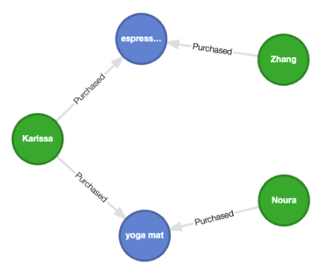

# Vector similarity search

This example demonstrates how to perform vector similarity search using the array functions defined
in Kùzu. Note that these functions essentially perform a kNN search. More support for similarity
search via an ANN index will be added in the future.

## Goal

Our goal in this example is to find the most similar vectors to a given query vector based on semantic
similarity. We will use the cosine similarity metric to measure the distance between vectors. The following
simple graph is used to demonstrate this.



The graph consists of persons and items. Each person has purchased one of two items: "espresso machine"
or "yoga mat".

### Question

The following question is being asked:

> Who is the youngest person that purchased a coffee maker?

As can be seen, a naive Cypher query that searches for the item "coffee maker" will return a null
response as there is no item with this name in the graph. However, we do have an item called "espresso
machine" which is a type of coffee maker. We can thus use vector similarity search to find the most similar item and return a more useful response.

### Embedding generation

The embeddings are generated by any model that can generate sentence embeddings. In this example, we use the `sentence-transformers` package to generate the embeddings. The embeddings are then stored in Kùzu via the new [`ARRAY`](https://docs.kuzudb.com/cypher/data-types/list/#array) data type in Kùzu
which is designed specifically for this purpose. An `ARRAY` is a special case of the `LIST` data type
whose length is fixed (and known upfront).

For this example, we use the "xs" (extra small) model from the [Arctic family of models](https://huggingface.co/collections/Snowflake/arctic-embed-661fd57d50fab5fc314e4c18)
released by Snowflake that has 384 dimensions, but you can use any other model of your choice.

## Setup

You can use the `uv` package manager to install the required dependencies:

```bash
uv venv
source .venv/bin/activate
uv pip install -r requirements.txt
```

## Usage

### Import data

The first script to run is `import_data.py`. This script generates the given graph of persons
and their purchased items.

```bash
python import_data.py
```

The following data is generated, along with the relationships between the persons and their
purchased items.

```
shape: (3, 3)
┌─────┬─────────┬─────┐
│ id  ┆ name    ┆ age │
│ --- ┆ ---     ┆ --- │
│ u64 ┆ str     ┆ u8  │
╞═════╪═════════╪═════╡
│ 1   ┆ Karissa ┆ 25  │
│ 2   ┆ Zhang   ┆ 29  │
│ 3   ┆ Noura   ┆ 31  │
└─────┴─────────┴─────┘
shape: (2, 3)
┌─────┬──────────────────┬─────────────────────────────────┐
│ id  ┆ name             ┆ vector                          │
│ --- ┆ ---              ┆ ---                             │
│ u64 ┆ str              ┆ array[f64, 384]                 │
╞═════╪══════════════════╪═════════════════════════════════╡
│ 1   ┆ espresso machine ┆ [0.051414, -0.015042, … -0.017… │
│ 2   ┆ yoga mat         ┆ [-0.018925, -0.034097, … 0.002… │
└─────┴──────────────────┴─────────────────────────────────┘
Finished importing nodes and rels
```

### Query the graph

The second script to run is `search.py`. This script queries the graph for the youngest person
that purchased a coffee maker. In Cypher, this can be expressed as shown below:

```cypher
MATCH (p:Person)-[:Purchased]->(i:Item)
WITH p, i, CAST($query_vector, "DOUBLE[384]") AS query_vector
RETURN
    p.name as person,
    p.age as age,
    i.name as item,
    array_cosine_similarity(i.vector, query_vector) AS similarity
ORDER BY similarity DESC, age
```

The script will output the following result:

```
┌─────────┬─────┬──────────────────┬────────────┐
│ person  ┆ age ┆ item             ┆ similarity │
│ ---     ┆ --- ┆ ---              ┆ ---        │
│ str     ┆ u8  ┆ str              ┆ f64        │
╞═════════╪═════╪══════════════════╪════════════╡
│ Karissa ┆ 25  ┆ espresso machine ┆ 0.832083   │
│ Zhang   ┆ 29  ┆ espresso machine ┆ 0.832083   │
│ Karissa ┆ 25  ┆ yoga mat         ┆ 0.724964   │
│ Noura   ┆ 31  ┆ yoga mat         ┆ 0.724964   │
└─────────┴─────┴──────────────────┴────────────┘
```

The correct answer is "Karissa" as she is the youngest person in this sample graph that purchased an espresso machine.

## Conclusion

The example code here demonstrates how to generate the vectors using a pretrained `sentence-transformers` model, load the data + embeddings into the relevant Kùzu tables, and run
similarity search queries. Appropriate typecasting is performed at various stages to ensure that
we pass the right data types to the array functions. Over time, this workflow will be streamlined
to make it more user-friendly, and also to support more scalable similarity search via an ANN index.
Stay tuned!
